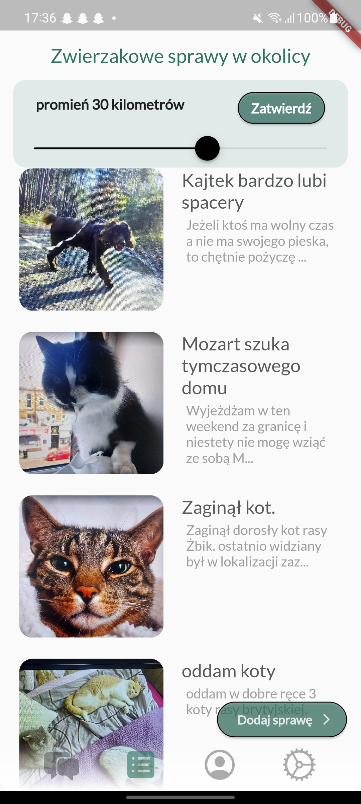

# take-my-pet-for-a-walk

#wersja 1 

app enabling pet owners to temporarily take in pet or simply take them for a walk. 

using Cloud Firestore, Firesotre, firebase Auth
Google APIs - static maps, Places, geocoding, Maps API
